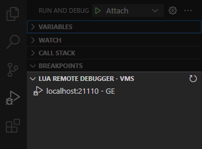

# Lua Remote Debugger for Visual Studio Code

Allows debugging embedded Lua VMs through Visual Studio Code.

Please also see the [developer docs](Readme_dev.md) if you want to work on it.

## Features

- Supports Windows, macOS and Linux
- Add/remove breakpoints
- Conditional breakpoints
- Continue, pause, step over, step in, step out
- View and modify Local, global, \_ENV, upvalue variables and arguments
- Watch window
- Evaluate expressions
- Remote debugging over TCP
- Multiple debug sessions possible at the same time
- New view in debug: `Lua Remote Debugger - VMs`.
 This is polling the ports from 21110 to 21120 on localhost to find any actively running session.

## Requirements

One of those lua Remote Debugger:
- [Garry's Mod Lua Remote Debugger](https://github.com/danielga/gm_rdb/releases)
- [Lua Remote Debugger](https://github.com/satoren/vscode-lrdb)

## Usage

Start the debugger server in your embedded Lua, then attach VS Code to it.

How to use:
- in [BeamNG](Readme_BeamNG.md)
- in [Garry's Mod](Readme_GM.md)

# Credits

Thank you very much to everyone working on this tech in open source team effort! :)

Based on the work from:
- [danielga/vscode-gmrdb](https://github.com/danielga/vscode-gmrdb)
- [satoren/vscode-lrdb](https://github.com/satoren/vscode-lrdb)
- [kapecp/vscode-lrdb](https://github.com/kapecp/vscode-lrdb)

